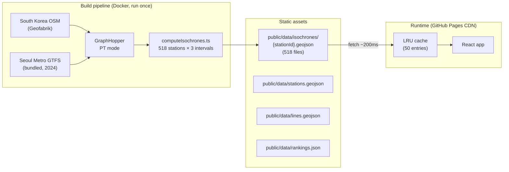
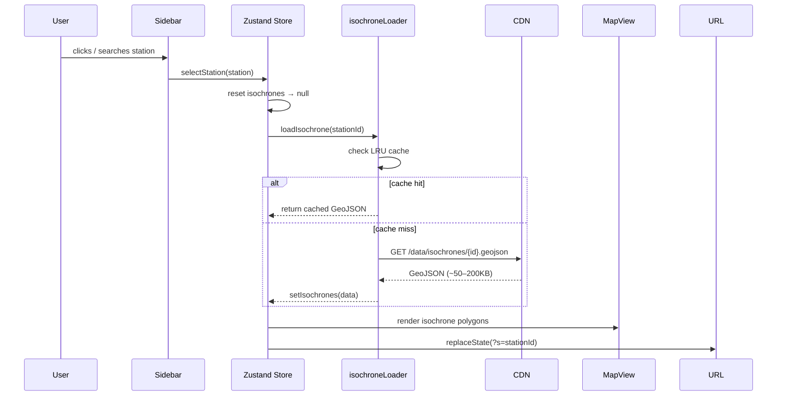
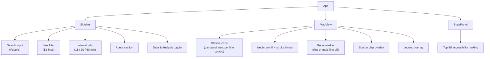

# Seoul Metro Isochrone

**Where can you reach from any Seoul Metro station in 15, 30, or 60 minutes?**

An interactive map showing transit reachability across the Seoul Metro network — useful for apartment hunting, commute planning, or exploring the city.

[**Live demo →**](https://matassp.github.io/seoul-isochrone/)

---

## Features

- **518 stations** across Lines 1–9, Bundang, Shinbundang, Gyeongui-Jungang, and Airport Railroad
- **Isochrone rings** at 15, 30, and 60 minutes (subway + walking, off-peak 14:00 weekday)
- **Station search** — Korean (강남역) and English (Gangnam)
- **Line filter** — show/hide individual lines
- **Accessibility ranking** — data panel with top-15 stations by reachable area
- **Shareable URLs** — selected station encoded as `?s=<id>`
- **Fast** — isochrones are static GeoJSON served from CDN, no routing server at runtime

---

## Architecture

Isochrones are **pre-computed once** at build time and shipped as static GeoJSON. No routing server runs at runtime.



### Runtime data flow



---

## Component Structure



---

## Tech Stack

| Layer | Choice |
|-------|--------|
| Framework | React 18 + TypeScript |
| Map | MapLibre GL JS |
| Basemap | MapTiler Dataviz (light + dark) |
| Routing (build-time only) | GraphHopper + Seoul Metro GTFS + South Korea OSM |
| State | Zustand |
| Search | Fuse.js |
| Build | Vite |
| Deploy | GitHub Pages |

---

## Local Development

### Prerequisites

- Node.js 18+, pnpm
- [MapTiler API key](https://cloud.maptiler.com) (free tier)
- Docker (only needed to regenerate isochrones)

### Setup

```bash
git clone https://github.com/matassp/seoul-isochrone.git
cd seoul-isochrone
pnpm install
cp .env.example .env
# Add your VITE_MAPTILER_KEY to .env
pnpm dev
```

Pre-computed isochrones are **not** checked in (too large). The app loads with station dots but no isochrone polygons until you either regenerate them or add the files manually.

### Regenerating Isochrones

```bash
# 1. Fetch station locations from OpenStreetMap
pnpm run fetch-stations

# 2. Download South Korea OSM extract → docker/data/south-korea-latest.osm.pbf
#    https://download.geofabrik.de/asia/south-korea.html
#    A 2024 Seoul Metro GTFS is already bundled at docker/gtfs/seoul-metro.gtfs.zip

# 3. Start GraphHopper (ingests GTFS + OSM, ~5 min on first run)
docker compose -f docker/docker-compose.yml up graphhopper

# 4. Compute all isochrones (~518 requests at concurrency=2)
pnpm run compute-isochrones

# 5. Shut down Docker
docker compose -f docker/docker-compose.yml down
```

GraphHopper runs at `http://localhost:8989` by default. Override with `GH_URL=http://...`.

---

## Isochrone File Format

Each `public/data/isochrones/<station-id>.geojson` is a GeoJSON `FeatureCollection` with up to 3 features (one per interval). Feature properties:

```json
{ "interval": 15, "stationId": "1797562528" }
```

Intervals: **15 / 30 / 60 minutes** — off-peak, 14:00 weekday departure.

---

## Data Sources

| Data | Source | License |
|------|--------|---------|
| Station locations | OpenStreetMap Overpass API | ODbL |
| Metro timetables | Seoul Metro GTFS (2024, bundled) | Public |
| Street network | Geofabrik South Korea OSM extract | ODbL |
| Basemap tiles | MapTiler Dataviz | Commercial (free tier) |
